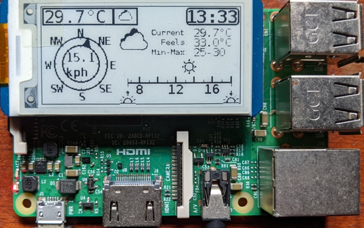

# pi-epaper-dashboard
This is a dashboard application using an E-Ink display hat on a Raspberry Pi. The application shows time of the day, weather and latest news.

Here is a snapshot of the application showing weather details.  



## Features
Application shows 
* Weather Details
* Top News Headlines

Weather data is provided by [OpenWeatherMap](https://openweathermap.org/).  
News data is provided by [NewsAPI](https://newsapi.org/)

## Hardware
1. Raspberry Pi
2. [Waveshare 2.13inch E-Ink display HAT for Raspberry Pi](https://www.waveshare.com/2.13inch-e-Paper-HAT.htm)

## Getting Started
### Prerequisites
* Create OpenWeatherMap API key. [Link](https://openweathermap.org/appid)
* Create NewsAPI API key. [Link](https://newsapi.org/account)
* Follow [steps](https://www.waveshare.com/wiki/2.13inch_e-Paper_HAT) to set up E-Ink Display.

### Clone Repository and install python dependencies
```bash
git clone --recurse-submodules https://github.com/NaikRaghavendra/pi-epaper-dashboard.git
cd pi-epaper-dashboard
pip3 install -r requirements.txt
```
### Configuration
Weather and News applications are configured by modifying [Config.yml](Config.yml) in project directory
#### Weather Application 
* *lat* : Latitude of the location used to query weather data
* *lon* : Longitude of the location used to query weather data
* *openweathermapapikey*: OpenWeatherMaps API key
* *refreshtimeoutinmins*: Timeout after which Weather application will request display of Weather data on the display.
#### News Application
Following parameters can be configured in news section of Config.yml
* *newsapikey*: NewsAPI API key
* *refreshtimeoutinmins*: Timeout after which News application will request display of news on the display.
* *topicsquery*: Query string to use for news query. Maps to 'q' parameter in [News Query API Parameters](https://newsapi.org/docs/endpoints/top-headlines)
* *country*: Country code to use for new query. Maps to 'country' parameter in [News Query API Parameters](https://newsapi.org/docs/endpoints/top-headlines)
* *category*: Category code to use for new query. Maps to 'category' parameter in [News Query API Parameters](https://newsapi.org/docs/endpoints/top-headlines)
* *displayrefreshtimeoutinmins*: 15

[Note] : Either of *topicsquery*, *country* or *category* code is mandatory.

### Run the program
```bash
./run.sh
```


## Starting application on Boot
Add a cronjob to run the script on boot of raspberry pi
```bash
crontab -e
```
Add following lines at the end of file
@reboot [FullPathToProjectDir]/run.sh


## Application Design
Project is designed to easily create and integrate new applications. Applications time share the display their content. 


